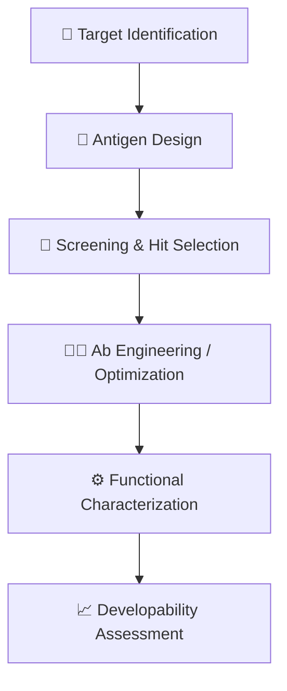

# AbRegistry: ETL Pipeline for Therapeutic Antibody Data Registration and Validation

A scalable data engineering solution for managing therapeutic antibody discovery workflows, integrating public databases with internal lab data through automated validation, orchestration, and quality control.

## 🎯 Project Overview

AbRegistry addresses the challenge of unifying antibody discovery data from multiple sources (public databases like SAbDab, internal lab notebooks) into a single, validated repository for discovery analytics. The pipeline automates data ingestion, validation, deduplication, and structural analysis.

### Key Features
- **Automated data ingestion** from SAbDab therapeutic antibody database (~10k sequences) - Other sources to follow.
- **File-based lab data integration** with validation and error handling
- **Antibody sequence analysis** including CDR annotation (using AntPack) and similarity searches (using KA-Search)
- **Orchestrated workflows** using Apache Airflow with branching logic
- **Quality control** through Pydantic validation and BioPython sequence analysis
- **Smart deduplication** using KA-Search for antibody-aware similarity detection
- **Structured transformations** via dbt for analytics-ready data models

### Typical Antibody Discovery Workflow



As I don't have access to real lab notebook data, I simulate lab uploads by randomly sampling and mutating sequences from SAbDab. We can categorize the data associated with each antibody into 4 classes (at simulation time):      
1. <u>**Sequence Data</u>:** Heavy and light chain sequences (_VH_, _VL_), _antibody format_, _VD LC_, **CDR region coordinates**. 
2. <u>**Target Information</u>:** _Antigen names_, UniProt IDs, _Application context_ (disease- and/or tissue-specificity), Affinity, ...
3. <u>**Origin of data</u>:** project name, researcher, company, discovery date -- randomly assigned during simulation
4. <u>**Metadata</u>:** everything else, which can evolve as the research advances:
   1. <u>Development metadata</u>: _development technology_, clinical trial phase, developability metrics, ... 
   2. <u>Structural metadata</u>: **similarity search results**, ...
   3. <u>Functional metadata</u>: assay results, epitope mapping, ...
   4. <u>Manufacturing metadata</u>: _expression system_, yield, stability, ...
   5. <u>Regulatory metadata</u>: patent status, regulatory filings, ...

NB: _italicized_ terms indicate that the data comes from the SAbDab database (used to simulate lab data), while **bold** terms indicate data that is computed during the pipeline (e.g. CDR coordinates, similarity search results). Other terms are either randomly assigned during simulation, or are possible fields for real lab notebook uploads/updates.

### Simulated Lab Data Generation Workflow

```mermaid
graph LR
    A[🫙 SAbDab Database] --> B[Random Sampling (HC and LC, format, VD LC, Targets, Dev Tech)]
    B --> C[🐜 CDR3 Mutation Application (AntPack)]
    C --> D[Assignment of Lab Metadata (Project, Researcher, Company, Date)]
```

---

## 🏗️ Architecture

### Data Flow (TO COMPLETE - diagram coming soon)
```
[SAbDab DB] ──┐
              ├──> [Airflow Orchestration] ──> [Validation] ──> [PostgreSQL Staging]
[Lab Uploads] ┘                                     │
                                                    ├──> [Valid] ──> [dbt Transform] ──> [Analytics Layer]
                                                    └──> [Invalid] ──> [Archive]
```

### Tech Stack
- **Orchestration:** Apache Airflow 3.1.5 (CeleryExecutor)
- **Database:** PostgreSQL 16 with SQLAlchemy ORM
- **Data Processing:** Polars, Pandas, BioPython
- **Validation:** Pydantic (planned)
- **Containerization:** Docker Compose
- **Transformations:** dbt (planned)
- **Analysis:** KA-Search for sequence similarity, AntPack for CDR annotation

---

## 📂 Project Structure
```
AbRegistry/
├── dags/                          # Airflow DAG definitions
│   ├── setup_database.py          # Initial SAbDab data load
│   ├── sim_lab_data.py            # Simulated lab data generation (dev)
│   └── dag_load_lab_data.py       # Production lab data ingestion
├── database/
│   ├── database.py                # SQLAlchemy engine & session
│   └── models.py                  # Database table definitions
├── scripts/
│   ├── load_data.py               # SAbDab ingestion logic
│   ├── load_lab_data.py           # Lab file validation & ingestion
│   └── generate_lab_sequences.py  # Simulated data with CDR3 mutations
├── data/
│   ├── raw/                       # Source data (SAbDab CSV)
│   ├── lab_uploads/               # Incoming lab files
│   └── archive/                   # Processed/invalid files
├── docker-compose.yml
├── Dockerfile
└── requirements.txt
```

---

## 🚀 Getting Started

### Prerequisites
- Docker & Docker Compose
- 8GB+ RAM recommended

### Setup

1. **Clone and navigate:**
```bash
gh repo clone SinaedaA/AbRegistry
cd AbRegistry
```

2. **Configure environment:**
```bash
echo "AIRFLOW_UID=$(id -u)" > .env
```

3. **Build and start services:**
```bash
docker-compose build
docker-compose up -d
```

4. **Access Airflow UI:**
```
http://localhost:8080
Username: airflow
Password: airflow
```

5. **Initialize database:**
Trigger the `setup_database` DAG in the UI to load SAbDab data.

---

## 📊 Database Schema

### Staging Layer (`staging.raw_sequences`)
```sql
id                 SERIAL PRIMARY KEY
source             VARCHAR(50)       -- 'SAbDab', 'Lab Notebook'
ab_name            VARCHAR(50)       -- Antibody identifier
ab_format          VARCHAR(200)      -- IgG, Fab, scFv, etc.
heavy_chain1       TEXT              -- VH sequence
light_chain1       TEXT              -- VL sequence
target             JSON              -- Antigen targets
development_metadata JSON            -- Clinical trial info
structural_metadata  JSON            -- Similarity search results
```

---

## 🔄 Pipeline Workflows

### 1. Initial Data Load (`setup_database`)
- Creates database schema
- Ingests ~10k SAbDab therapeutic antibodies
- One-time setup task

### 2. Lab Data Ingestion (`dag_load_lab_data`)
**Schedule:** Daily at midnight
**Flow:**
```
Find new files → Validate format → Branch
                                    ├─> Valid: Ingest → Archive
                                    └─> Invalid: Archive + Log errors
```

**Validation checks:**
- File format (CSV)
- Required columns present
- Non-null constraints
- Sequence validity

### 3. Simulated Data Generation (`sim_lab_data`)
**Schedule:** Daily (development only)
- Samples random from SAbDab sequences (between 1 and 5)
- Detects CDR3 regions using AntPack
- Applies CDR3 mutations to mimic natural variation
- Generates lab notebook entries (assigns random Project, Researcher, Company, and discovery date)

---

## 🛠️ Development Roadmap 📈

- [x] Docker infrastructure setup
- [x] Database models and schema
- [x] SAbDab data ingestion
- [x] Simulated lab data generation
- [x] Lab file validation pipeline
- [x] Automated orchestration with Airflow
- [ ] Data validation with Pydantic
- [ ] **Week 3:** Sequence annotation (AntPack) + KA-Search similarity analysis integration
- [ ] **Week 4:** dbt data transformations (staging → analytics)
- [ ] **Week 5:** Deduplication logic and conflict resolution
- [ ] **Week 6:** Jupyter notebook query interface

---

## 🛠️ Future Features
- Real lab notebook uploads via **file drop** or **API connection**
- Enhanced query interface (**web app**)
- Advanced analytics (e.g. clustering, visualization)
- Implementation of HELM notation for antibody sequences
- Partial ingestion of Ab sequence files from 'lab notebooks' with detailed error reporting (when many seqs are uploaded at once, and a small subset are not valid Ab sequences)
  - configurable threshold based validation (e.g. <10% invalid → partial ingest) - Airflow variables
  - archive/partial/ subdirectory for partially valid files
  - user notification system

---

## Context

This is my capstone project for the Neuefische Data Engineering Bootcamp. Project topic inspired by a personal job application. Feedback welcome!

---

## 📄 License
GNU General Public License v3.0